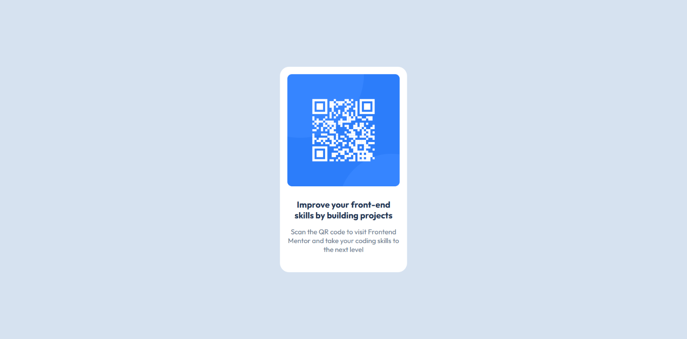

# Frontend Mentor - QR code component solution

This is a solution to the [QR code component challenge on Frontend Mentor](https://www.frontendmentor.io/challenges/qr-code-component-iux_sIO_H). Frontend Mentor challenges help you improve your coding skills by building realistic projects. 

## Table of contents

- [Overview](#overview)
  - [Screenshot](#screenshot)
- [My process](#my-process)
  - [Built with](#built-with)
  - [What I learned](#what-i-learned)
- [Author](#author)
- [Bye](#bye)

**Note: Delete this note and update the table of contents based on what sections you keep.**

## Overview

### Screenshot

Desktop Version



Mobile Version


## My process

### Built with

- Semantic HTML5 markup
- CSS custom properties
- Flexbox
- Media queries

### What I learned

```css
width: 275px;
```

using fixed width instead of relative width is usually the best option!

## Author

- Frontend Mentor - [@iyedoo](https://www.frontendmentor.io/profile/iyedoo)

## Bye

Thanks for reading that lol!
